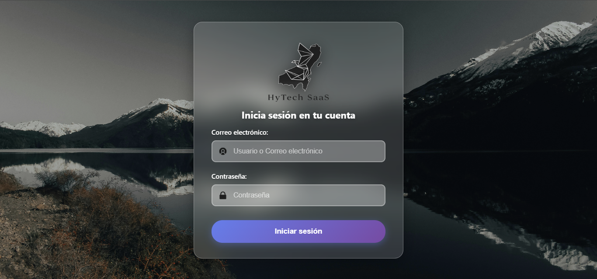
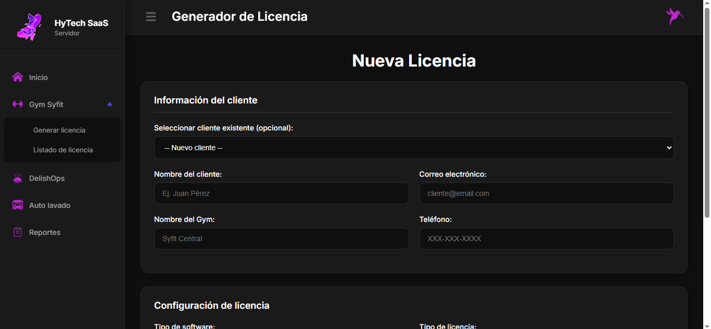
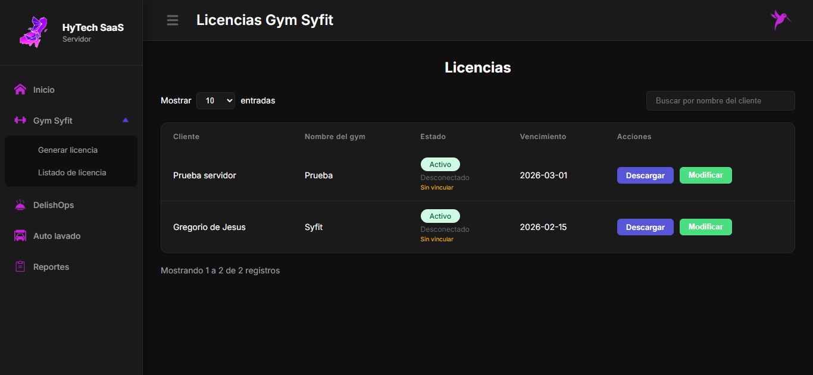

<p align="center"><a href="https://laravel.com" target="_blank"></a></p>

<p align="center">
<a href="https://github.com/laravel/framework/actions"></a>
<a href="https://packagist.org/packages/laravel/framework"></a>
<a href="https://packagist.org/packages/laravel/framework"></a>
<a href="https://packagist.org/packages/laravel/framework"></a>
</p>

# License Hytech

Sistema SaaS de gestión y validación de licencias para aplicaciones de escritorio (ej. Electron). Incluye panel administrativo web y API segura para validación remota de licencias vinculadas a hardware.

---

## ✨ Características

* Generación de licencias cifradas descargables
* Vinculación automática por HWID
* Verificación remota por API
* Expiración automática
* Registro de actividad de licencias
* Panel administrativo (solo servidor privado)
* Soporte multi‑cliente

---

## 🧩 Arquitectura

Aplicación dividida en dos partes:

1. Servidor Laravel (este repositorio)

   * Genera y valida licencias
   * Provee endpoints API

2. Cliente Desktop (no incluido)

   * Envía HWID
   * Consume endpoints de verificación

---

## 🔐 Importante (Repositorio público)

Este repositorio es una versión DEMO del servidor.

Se eliminaron deliberadamente:

* Credenciales reales
* Configuración productiva
* Panel administrativo completo
* Variables sensibles

El servidor productivo contiene lógica adicional de seguridad no publicada.

---

## 🚀 Instalación local

### Requisitos

* PHP 8.2+
* Composer
* MySQL (Local, en la caperta "database" se encuentra la base de datos nombrada "BD.sql")
* Node (opcional para assets)

### Pasos

```bash
# Clonar repositorio
git clone <repo>
cd servidor-hytech

# Dependencias
composer install

# Configuración
cp .env.example .env
php artisan key:generate

# Base de datos
Importar la base de datos en tu gestor de administrador de base de datos.

# Servidor
php artisan serve
```

---

## ⚙️ Variables de entorno necesarias

Ejemplo mínimo:

```
APP_NAME=LicenseHytech
APP_ENV=local
APP_KEY=
APP_DEBUG=true
APP_URL=http://localhost

DB_CONNECTION=mysql
DB_HOST=127.0.0.1
DB_PORT=3306
DB_DATABASE=licenses
DB_USERNAME=root
DB_PASSWORD=
```

---

## 🔌 Endpoints API

### 1. Verificar archivo de licencia

POST `/api/check-license`

Body:

```json
{
  "license_key": "archivo_encriptado",
  "hwid": "DEVICE_ID"
}
```

Respuesta exitosa:

```json
{
  "status": "success",
  "client": "Cliente",
  "gym": "Nombre",
  "expires_at": "2026-01-01",
  "token": "session_token"
}
```

---

### 2. Verificación periódica

POST `/api/verify-license`

```json
{
  "license_key": "HY-XXX-XXXX",
  "hwid": "DEVICE_ID"
}
```

---

## 🛡️ Seguridad implementada

* Licencias cifradas con clave del servidor
* Vinculación por hardware
* Token de sesión temporal
* Expiración automática
* Invalidación por estado

---

## ❗ Nota para desarrolladores

Este proyecto no está diseñado para ejecutarse como SaaS público directo.
Requiere endurecimiento adicional antes de producción.

---

## 📄 Licencia

Uso educativo y demostrativo únicamente.

## 🖼️ Capturas del sistema

### Autenticación de cliente



### Generador de licencias



### Validación desde cliente

